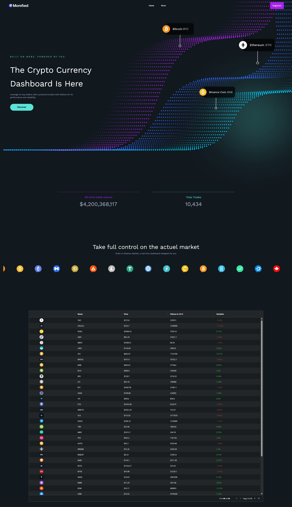

# Monified

> Projet ancien — pas de mises à jour prévues, réalisé pour montée en compétence.

Monified est une plateforme full-stack qui agrège données crypto, actualités et gestion de comptes. Le dépôt contient l’API Node/Express (Sequelize + JWT + Passport) et l’interface Quasar/Vue 3. L’objectif de cette remise à niveau est d’obtenir une base démontrable (portfolio) tout en limitant les risques de secrets ou de régressions.

## Stack & structure

| Dossier / Fichier        | Contenu principal |
|-------------------------|-------------------|
| `front/`                | Application Quasar (Vue 3, Pinia, Axios) + tests/lint |
| `server/`               | API Express, Sequelize (MySQL), Passport Google/Microsoft, Jest |
| `docker-compose.yml`    | Services MySQL + API, orchestrés via `.env` |
| `.env.example`          | Variables racine utilisées par Compose et les apps |
| `docs/`                 | Captures d’écran (usage portfolio) |

## Démarrage rapide

### Prérequis
- Node.js 18.x (front & server)
- npm 9+ ou équivalent
- Docker Desktop + Docker Compose v2 (pour l’orchestration)

### Mode développeur (local)
1. Copier les variables : `cp .env.example .env`
2. API  
   ```bash
   cd server
   npm install
   npm run dev
   ```  
   Le serveur écoute par défaut sur `http://localhost:8080`.
3. Frontend  
   ```bash
   cd front
   npm install
   npx quasar dev
   ```  
   UI accessible via `http://localhost:9000`.

### Mode Docker Compose
```bash
cp .env.example .env           # à la racine
docker compose up --build
```
- MySQL : `localhost:${MYSQLDB_LOCAL_PORT}` (3306 par défaut)
- API : `http://localhost:${PORT}` (8080 par défaut)

Arrêt et nettoyage : `docker compose down` (ajouter `-v` pour réinitialiser les données locales).

## Scripts utiles

| Contexte | Commande | Description |
|----------|----------|-------------|
| API      | `npm run dev` | Express + nodemon |
|          | `npm run start` | Exécution Node sans watch |
|          | `npm test` | Jest + Supertest (SQLite in-memory) |
| Front    | `npx quasar dev` | SPA en mode dev |
|          | `npm run lint` | ESLint (`.js`, `.vue`) |
|          | `npx quasar build` | Build SPA production |

## Matrice des variables d’environnement

| Contexte | Variable | Description / usage | Exemple |
|----------|----------|---------------------|---------|
| Racine / Compose | `COMPOSE_PROJECT_NAME` | Nom du projet Docker | `monified` |
|                  | `NODE_ENV` | Profil global | `development` |
|                  | `CLIENT_ORIGIN` | URL front autorisée par l’API | `http://localhost:8000` |
| MySQL / Compose  | `MYSQLDB_ROOT_PASSWORD` | Mot de passe root MySQL | `changeme-root-password` |
|                  | `MYSQLDB_DATABASE` | Base initiale | `countofmoney` |
|                  | `MYSQLDB_USER` | Utilisateur applicatif | `root` |
|                  | `MYSQLDB_LOCAL_PORT` | Port exposé côté hôte | `3306` |
| API (server/.env) | `PORT` | Port HTTP de l’API | `8080` |
|                  | `LOG_LEVEL` | Niveau logger custom | `debug` |
|                  | `DB_HOST` / `DB_PORT` | Cible Sequelize | `db` / `3306` |
|                  | `DB_NAME` / `DB_USER` / `DB_PASSWORD` | Credentials DB | selon .env |
|                  | `DB_DIALECT` / `DB_STORAGE` | `mysql` ou `sqlite` (tests) | `mysql` |
| Sécurité         | `SESSION_SECRET` | Signature des sessions Express | `change-me` |
|                  | `JWT_SECRET` / `JWT_EXPIRES_IN` | Signature des tokens | `replace-with-jwt-secret` / `1d` |
| OAuth Google     | `GOOGLE_CLIENT_ID` / `GOOGLE_CLIENT_SECRET` / `GOOGLE_CALLBACK_URL` | Identifiants Google OAuth | `...apps.googleusercontent.com` |
| OAuth Microsoft  | `MS_CLIENT_ID` / `MS_CLIENT_SECRET` / `MS_CALLBACK_URL` / `MS_TENANT_ID` | Identifiants Microsoft | `common` |
| Front Quasar     | `VITE_API_BASE_URL` | Base Axios côté front | `http://localhost:8080/api` |

> Aucun secret réel ne doit être commité : dupliquer `.env.example` pour chaque environnement.

## Tests & qualité
- **API** : `cd server && npm test` (Jest + Supertest, SQLite en mémoire).  
- **Front** : `cd front && npm run lint && npx quasar build` (garantit un bundle prêt à embarquer).

Des suites de tests end-to-end peuvent être branchées en aval (Playwright/Cypress) mais ne font pas partie de ce scope.

## Dépannage
- **Ports occupés** : vérifier que `8080` (API) et `3306` (MySQL) sont libres, sinon ajuster dans `.env`.
- **Base corrompue** : `docker compose down -v && docker compose up --build` pour repartir d’un schéma propre.
- **Env manquant** : chaque service charge d’abord `.env`; un oubli entraîne des valeurs par défaut peu sûres (`change-me`). Garder les placeholders à jour.
- **Dépendances front** : Quasar requiert Node 18; si vous utilisez Node 20+, activer `corepack enable` + `pnpm` (non inclus ici).

## Captures d’écran

| Aperçu | Description |
|--------|-------------|
|  | Vue d’accueil connectée : top cryptos, graphiques et actus. |

## License & remerciements
- Code distribué sous licence [MIT 2025 Samuel Cadau](LICENSE.md).
- Technologies principales : Quasar/Vue, Axios, Express, Sequelize, Passport, Docker. Merci aux mainteneurs de ces projets open-source.
